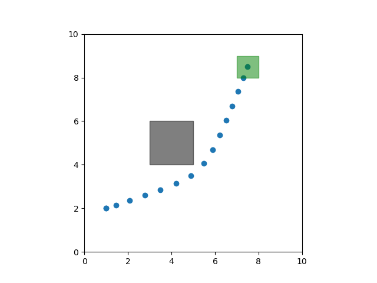
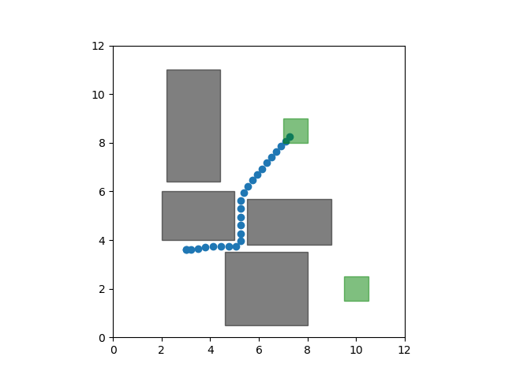
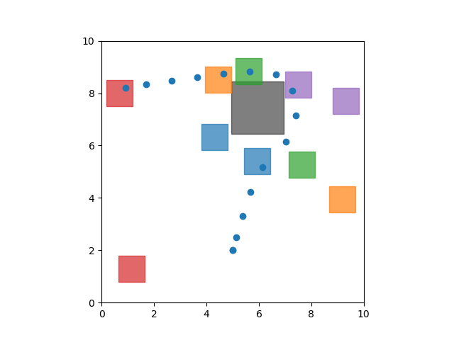
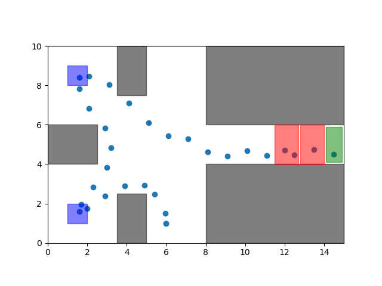
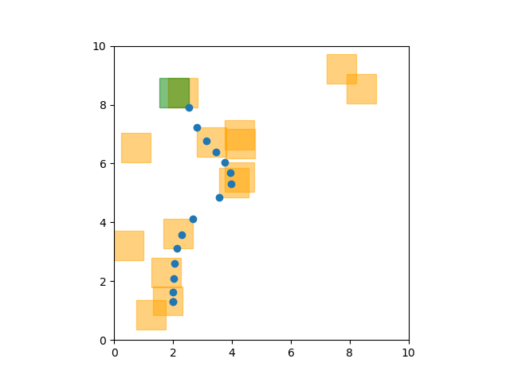

==========
Benchmarks
==========

Benchmark scenarios for evaluating 
different control approaches. 

Reach-Avoid
===========

A robot (blue dots) must avoid an obstacle (grey) and reach a goal (green).

.. autoclass::
    pySTL.benchmarks.ReachAvoid
    :members:
    :show-inheritance:

Nonlinear Reach-Avoid
=====================

A robot (blue dots) must avoid an obstacle (grey) and reach a goal (green). 
The goal and obstacle are both circles, requiring nonlinear predicates. 
The robot has (nonlinear) :ref:`unicycle<Unicycle>` dynamics.

Due to the nonlinear dynamics and nonlinear predicates, this benchmark
cannot be currently be solved with MICP-based methods. It can be solved
using gradient-based optimization.

.. image:: images/nonlinear_reach_avoid.png
    :width: 400
    :alt: A picture of the nonlinear reach-avoid scenario.

.. autoclass::
    pySTL.benchmarks.NonlinearReachAvoid
    :members:
    :show-inheritance:

Either-Or
=========

In addition to avoiding an obstacle (grey) and reaching a goal (green), the robot
must visit one of two intermediate target regions (blue) and stay at the target
for several timesteps.

.. image:: images/either_or.png
    :width: 400
    :alt: A picture of the either-or scenario.

.. autoclass::
    pySTL.benchmarks.EitherOr
    :members:
    :show-inheritance:

Narrow Passage
==============

A robot must avoid several obstacles (grey) and reach one of two
goals (green), and the passageway between obstacles is narrow.

.. autoclass::
    pySTL.benchmarks.NarrowPassage
    :members:
    :show-inheritance:

Multi-Target
============

A robot must avoid obstacles (grey) and visit at least one target of each type/color.
Targets and obstacles are placed randomly.

.. autoclass::
    pySTL.benchmarks.RandomMultitarget
    :members:
    :show-inheritance:

Door Puzzle
===========

A robot must avoid obstacles (grey) and reach a goal (green), but before reaching the goal
it must pass through several doors (red). It can only pass through a door once the corresponding 
key has been picked up (e.g., visit the blue region). 

.. autoclass::
    pySTL.benchmarks.DoorPuzzle
    :members:
    :show-inheritance:

Stepping-Stones
===============

The robot must reach a goal (green), but can only step in certain areas (yellow). 
The goal and stepping stone locations are randomly generated. 

.. autoclass::
    pySTL.benchmarks.SteppingStones
    :members:
    :show-inheritance:

Adding New Benchmarks
=======================

To add additional benchmark scenarios, simply create
a class that inherits from the following ``BenchmarkScenario`` class:

.. autoclass::
    pySTL.benchmarks.base.BenchmarkScenario
    :members:
    :show-inheritance:

Helper functions
==========================

inside_rectangle_formula
------------------------
.. autofunction::
    pySTL.benchmarks.common.inside_rectangle_formula

outside_rectangle_formula
-------------------------
.. autofunction::
    pySTL.benchmarks.common.outside_rectangle_formula

inside_circle_formula
---------------------
.. autofunction::
    pySTL.benchmarks.common.inside_circle_formula

make_rectangle_patch
--------------------
.. autofunction::
    pySTL.benchmarks.common.make_rectangle_patch

make_circle_patch
--------------------
.. autofunction::
    pySTL.benchmarks.common.make_circle_patch
