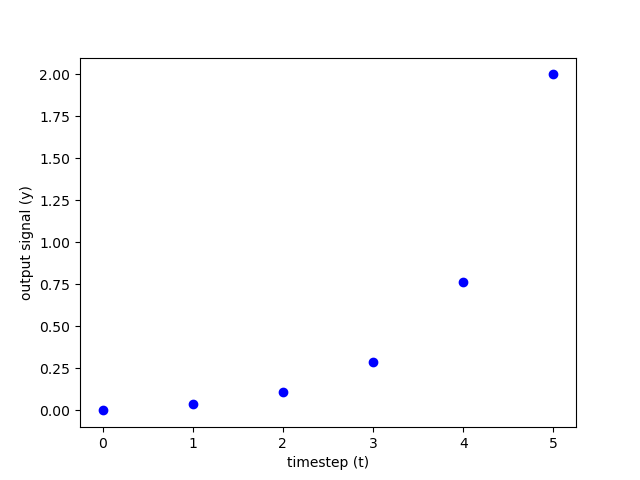

=================================
Getting Started
=================================

Installation
=================================

Via pip: 
::
    pip install stlpy

From source:
::

    git clone https://github.com/vincekurtz/stlpy
    cd stlpy
    python setup.py install

Dependencies
=================================

Required Packages
-----------------

The following are required for the core functionality
of this software (defining STL formulas). 

- Python version 3.6 or higher
- numpy
- treelib
- matplotlib

Solver-Specific Packages
------------------------

These are solver-specific dependencies, and are needed to enable 
particular :ref:`synthesis algorithms<Solving Control Problems>`.
STL formulas can be defined and evaluated without these dependencies.

- `scipy <https://scipy.org/>`_ - used for the most basic gradient-based optimization
- `Gurobi <https://gurobi.com/>`_ version 9.1 or higher (with python bindings) - used 
  for basic mixed-integer programming
- `Drake <https://drake.mit.edu/>`_ with Gurobi/Mosek enabled - used 
  for more advanced mixed-integer programming
- Drake with SNOPT enabled - used for more efficient gradient-based optimization

.. note::
    
    Drake with Gurobi/Mosek enabled requires compilation from source. See
    `here <https://drake.mit.edu/from_source.html#building-the-python-bindings>`_
    for more details.

.. note::

    Drake's binary releases include SNOPT (no license required). 

A Simple Example
=================================

In this section, we'll consider a simple one-dimensional linear system

.. math::

    x_{t+1} = x_t + u_t 

    y_t = x_t

subject to a simple STL specification

.. math::

    \varphi = F_{[0,5]} (y > 2),

which can be read as "eventually, between timesteps 0 and 5, y must be greater than 2."

First we'll import everything we need to set up the optimization problem, solve it, and
visualize the solution:

::

    import numpy as np
    import matplotlib.pyplot as plt
    from stlpy.systems import LinearSystem
    from stlpy.STL import LinearPredicate
    from stlpy.solvers import DrakeMICPSolver

We'll then define the simple linear system shown above, along with an initial condition :math:`x_0 = 0`.

::

    A = np.array([[1.]])
    B = np.array([[1.]])
    C = np.array([[1.]])
    D = np.array([[0.]])
    sys = LinearSystem(A,B,C,D)
    
    x0 = np.array([[0]])

Now we can the specification. We do this recursively, starting with the 
predicate :math:`\pi = (y>0)` and building up to the whole STL formula :math:`\varphi`
by applying boolean and temporal operators:

::
    
    pi = LinearPredicate(a=[1], b=[2])  # a*y - b > 0
    spec = pi.eventually(0, 5)          # F_[0,5] pi

Then we set up a solver object, and tell it to look for a trajectory with 5
timesteps. Just for fun, we'll and a quadratic running cost 
:math:`\|x_t\|^2 + \|u_t\|^2` as well. 

::

    solver = DrakeMICPSolver(spec, sys, x0, 5)
    solver.AddQuadraticCost(Q=np.eye(1), R=np.eye(1))
    x, u, _, _ = solver.Solve()

Finally, we can make a nice plot of the solution:

::

    plt.plot([0,1,2,3,4,5], x.flatten(), 'bo')
    plt.xlabel("timestep (t)")
    plt.ylabel("output signal (y)")
    plt.show()

More Examples
=================================

Can be found in the `examples` folder.
